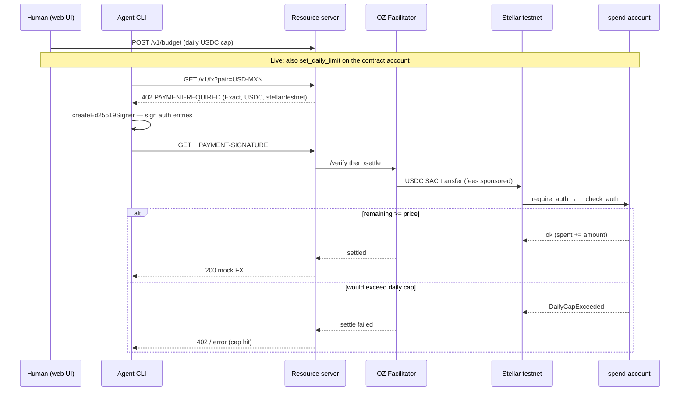

# AgentPaywall

Per-request **USDC** for HTTP APIs, using **x402 on Stellar**. A **human** sets a daily spend cap. An **agent** pays. When the cap is gone, **Soroban `__check_auth` refuses the transfer** — the adversarial demo is a failed on-chain settle, not a polite 429 in Node.

Built for **HackMeridian Lisboa / Stellar Pro**.

## Pitch

Agents will empty a hot wallet if the only control is “please don’t loop.” AgentPaywall splits roles:

- **Seller API** — `GET /v1/fx?pair=USD-MXN` is gated with x402 Exact (`@x402/express` + `@x402/stellar`). Unpaid → **402**. Paid → mock FX JSON.
- **Agent CLI** — handles 402, signs **Soroban auth entries** (`createEd25519Signer`), retries.
- **Human UI** — sets the daily USDC cap and reads the activity log.
- **Spend-account contract** — contract-account pattern: remaining allowance lives in instance storage, keyed by `ledger_timestamp / 86_400`. Over-limit `transfer` on the USDC SAC → `DailyCapExceeded`.

## Architecture



## Official constants (do not invent others)

| Thing | Value |
| --- | --- |
| Network | `stellar:testnet` |
| Testnet USDC issuer | `GBBD47IF6LWK7P7MDEVSCWR7DPUWV3NY3DTQEVFL4NAT4AQH3ZLLFLA5` |
| Testnet USDC SAC | `CBIELTK6YBZJU5UP2WWQEUCYKLPU6AUNZ2BQ4WWFEIE3USCIHMXQDAMA` |
| OZ facilitator | `https://channels.openzeppelin.com/x402/testnet` |
| OZ API key | generate at https://channels.openzeppelin.com/testnet/gen |

There is **no** official spend-account contract id. `scripts/deploy-testnet.sh` prints **your** `C...` after deploy. Leave `SPEND_ACCOUNT_CONTRACT_ID` empty until then.

`payTo` on the API is a classic **G...** account with a USDC trustline, not the SAC.

## Stub vs live (honest)

| | Stub (default) | Live |
| --- | --- | --- |
| Trigger | `OZ_API_KEY` or classic `STELLAR_RECIPIENT` missing (`X402_MODE=auto`) | both set — stub **off** |
| 402 | local Exact-shaped body | `@x402/express` + OZ `/verify` + `/settle` |
| Daily cap | in-memory UTC day (UI / `--until-cap`) | same UI mirror; on-chain cap only if spend-account is the payer |
| USDC movement | none | Exact transfer on the official testnet USDC SAC |

`GET /v1/status` reports `mode`, `settle` (`stub` \| `oz-facilitator`), facilitator probe, and Horizon trustline for the merchant. `X402_MODE=stub` forces stub even with keys.

## Live settle checklist

Nine steps. Secrets stay in your local `.env` — never commit them.

1. `cp .env.example .env`
2. Two testnet accounts: merchant `G...` (`STELLAR_RECIPIENT`) and payer `S...` (`STELLAR_SECRET_KEY`). Lab: https://lab.stellar.org/account/create
3. Friendbot XLM on **both** public keys: `curl "https://friendbot.stellar.org?addr=G..."` (or the Lab fund page)
4. USDC trustline on **both**, issuer `GBBD47IF6LWK7P7MDEVSCWR7DPUWV3NY3DTQEVFL4NAT4AQH3ZLLFLA5` — `node scripts/add-usdc-trustline.mjs` (uses the payer secret) and again with the merchant secret
5. Payer USDC: https://faucet.circle.com → **Stellar Testnet** → payer `G...` (web Captcha; no API)
6. OZ testnet key: https://channels.openzeppelin.com/testnet/gen → `OZ_API_KEY`
7. Confirm `.env` has `STELLAR_NETWORK=stellar:testnet`, `FACILITATOR_URL=https://channels.openzeppelin.com/x402/testnet`, official `USDC_ISSUER` / `USDC_SAC`
8. `npm run dev:api` — `GET /v1/status` must show `"mode":"live"` and `settle: "oz-facilitator"` (clear error if the key or payTo is wrong)
9. `npm run start -w @agentpaywall/agent -- --pair USD-MXN --verbose` — **200** + mock FX after a real Exact settle, or a **clear** `UNDERFUNDED` / `NO_TRUSTLINE` / `FACILITATOR_AUTH` error

`payTo` is the merchant **G...**, not the SAC. The agent uses `createEd25519Signer` + `wrapFetchWithPaymentFromConfig`. Spend-account deploy (`scripts/deploy-testnet.sh`) is optional and does **not** gate this path.

## Repo layout

```
packages/api            Node Express resource server (Exact scheme)
packages/agent          CLI payer (402 → sign → retry)
packages/web            Human budget + activity (Vite + React)
contracts/spend-account Soroban daily cap in __check_auth
scripts/deploy-testnet.sh
scripts/demo.sh
docs/JUDGES.md
```

## Run locally

Node 20+. From the repo root:

```bash
cp .env.example .env   # leave OZ_API_KEY empty for stub
npm install

# terminal 1 — API (http://127.0.0.1:40211)
npm run dev:api

# terminal 2 — human UI (http://127.0.0.1:41791)
npm run dev:web

# terminal 3 — agent pays for a mock USD-MXN quote
npm run start -w @agentpaywall/agent -- --pair USD-MXN --verbose

# adversarial: loop until cap rejects
npm run start -w @agentpaywall/agent -- --until-cap
```

Or `bash scripts/demo.sh` (API must already be up). `bash scripts/demo.sh --until-cap` for the cap hit.

### Each package

| Package | Command | What you get |
| --- | --- | --- |
| API | `npm run dev:api` | `GET /health`, `/v1/status`, `/v1/fx` (paid), `/v1/budget` |
| Agent | `npm run start -w @agentpaywall/agent -- --help` | payer CLI |
| Web | `npm run dev:web` | cap slider + activity log |
| Contract | `cd contracts/spend-account && make test` | allow + deny `__check_auth` tests |

## Day 1 checklist (stub, no secrets)

- [ ] `npm install` && `npm run dev:api` — logs `STUB mode`
- [ ] Unpaid `curl -i http://127.0.0.1:40211/v1/fx?pair=USD-MXN` → **402**
- [ ] Web UI: set cap to `0.002`, probe `/v1/fx` (still 402, no browser wallet)
- [ ] Agent once → **200** mock FX
- [ ] Agent `--until-cap` → **DAILY_CAP_EXCEEDED**
- [ ] Read [docs/JUDGES.md](docs/JUDGES.md)

## Optional: on-chain daily cap

Live settle above uses a **classic G... payer**. `contracts/spend-account` can refuse USDC `transfer` in `__check_auth`, but only when that contract account is the `from` on the SAC call. The Node CLI does not sign as a contract account yet.

```bash
bash scripts/deploy-testnet.sh          # notes + build; deploy if STELLAR_DEPLOY_IDENTITY is set
bash scripts/deploy-testnet.sh --notes-only
```

Paste the printed `C...` into `SPEND_ACCOUNT_CONTRACT_ID`. Do not invent one. The web UI cap remains the dashboard / stub `--until-cap` demo.

## Docs

- x402 on Stellar: https://developers.stellar.org/docs/build/agentic-payments/x402
- Built on Stellar facilitator: https://developers.stellar.org/docs/build/agentic-payments/x402/built-on-stellar
- Quickstart (Express + client): https://developers.stellar.org/docs/build/agentic-payments/x402/quickstart-guide
- Spend limits: https://developers.stellar.org/docs/build/guides/contract-accounts/advanced-patterns
- Complex account: https://developers.stellar.org/docs/build/smart-contracts/example-contracts/complex-account
- `@x402/stellar`: https://www.npmjs.com/package/@x402/stellar
- Public demo: https://stellar.org/x402-demo

## Env

See [.env.example](.env.example). Never commit `.env`. We do not ship sample secrets.

## License

Apache-2.0 for the Soroban skeleton; application code is provided for the hackathon as-is.
