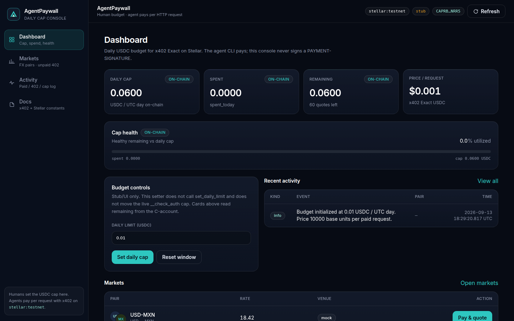
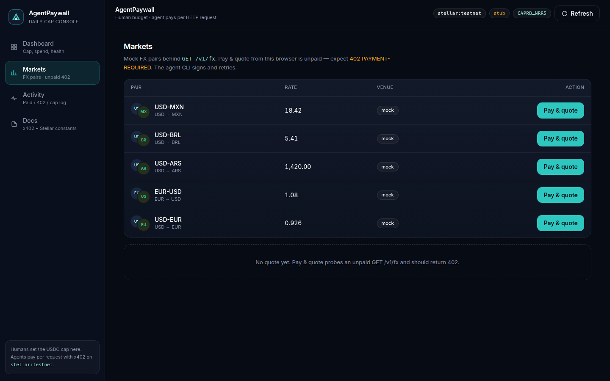

# AgentPaywall

Per-request **USDC** for HTTP APIs — **x402 on Stellar**. A human sets a daily cap; the agent pays; when the cap is gone, **Soroban `__check_auth` refuses the transfer**.

**Judges (HackMeridian Lisboa, 25–26 Oct 2026):** start at [docs/JUDGES.md](docs/JUDGES.md). Live demo C-account and `--until-cap` path are there.

```bash
npm install
npm run dev:api          # http://127.0.0.1:40211
npm run dev:web          # http://127.0.0.1:41791  (Aave-style dashboard)
npm run start -w @agentpaywall/agent -- --until-cap
```

Leave `.env` empty for stub. Live settle needs local secrets — never commit them.

## Live testnet demo

The C-account below is **this deploy** (already on `stellar:testnet`). It is **not** an official constant. Deploy your own with `scripts/deploy-testnet.sh`.

| | |
| --- | --- |
| Spend-account (this deploy) | `CAPRBG7V5JQRGWNQ5Z5AKRQ4X46G3UJRQNVXLUKZIWHEHWBNAMBBNRR5` |
| StellarExpert (testnet) | [contract page](https://stellar.expert/explorer/testnet/contract/CAPRBG7V5JQRGWNQ5Z5AKRQ4X46G3UJRQNVXLUKZIWHEHWBNAMBBNRR5) |
| Horizon | No C-account page — Horizon `/accounts/{id}` is **G… only** |

Live x402 Exact pays **FROM** that C… (`spendAccount.enforcesLiveTransfers: true`).

`GET /v1/status` → `spendAccount` after UTC day rollover **2026-09-13** (`source: "on-chain"`):

```json
{
  "contractId": "CAPRBG7V5JQRGWNQ5Z5AKRQ4X46G3UJRQNVXLUKZIWHEHWBNAMBBNRR5",
  "enforcesLiveTransfers": true,
  "source": "on-chain",
  "dailyLimitUsdc": 0.06,
  "spentTodayUsdc": 0,
  "remainingUsdc": 0.06
}
```

`spent_today` / `remaining` move when someone pays or the UTC day rolls. Re-read `/v1/status`; do not treat the snapshot as a constant.



*Local `npm run preview -w @agentpaywall/web` reading this deploy’s `spendAccount` (`source: "on-chain"`, remaining 0.06 USDC after the 2026-09-13 UTC roll). The mode badge is stub when `OZ_API_KEY` is unset; the cards still simulate the C-account.*



## Pitch

Agents will empty a hot wallet if the only control is “please don’t loop.” AgentPaywall splits roles:

- **Seller API** — `GET /v1/fx?pair=USD-MXN` is gated with x402 Exact (`@x402/express` + `@x402/stellar`). Unpaid → **402**. Paid → mock FX JSON.
- **Agent CLI** — handles 402, signs **Soroban auth entries** (`createEd25519Signer`), retries.
- **Human UI** — sets the daily USDC cap and reads the activity log.
- **Spend-account contract** — contract-account pattern: remaining allowance lives in instance storage, keyed by `ledger_timestamp / 86_400`. Over-limit `transfer` on the USDC SAC → `DailyCapExceeded`.

## Architecture

```mermaid
sequenceDiagram
  participant Human as Human (web UI)
  participant Agent as Agent CLI
  participant API as Resource server
  participant OZ as OZ Facilitator
  participant Chain as Stellar testnet
  participant SA as spend-account

  Human->>API: GET /v1/status (on-chain remaining)
  Note over Human,SA: Live cards read spend-account; POST /v1/budget is stub/UI only
  Agent->>API: GET /v1/fx?pair=USD-MXN
  API-->>Agent: 402 PAYMENT-REQUIRED (Exact, USDC, stellar:testnet)
  Agent->>Agent: sign spend-account AccSignature (owner ed25519)
  Agent->>API: GET + PAYMENT-SIGNATURE
  API->>OZ: /verify then /settle
  OZ->>Chain: USDC SAC transfer (fees sponsored)
  Chain->>SA: require_auth → __check_auth
  alt remaining >= price
    SA-->>Chain: ok (spent += amount)
    OZ-->>API: settled
    API-->>Agent: 200 mock FX
  else would exceed daily cap
    SA-->>Chain: DailyCapExceeded
    OZ-->>API: settle failed
    API-->>Agent: 402 / error (cap hit)
  end
```

## Official constants (do not invent others)

| Thing | Value |
| --- | --- |
| Network | `stellar:testnet` |
| Testnet USDC issuer | `GBBD47IF6LWK7P7MDEVSCWR7DPUWV3NY3DTQEVFL4NAT4AQH3ZLLFLA5` |
| Testnet USDC SAC | `CBIELTK6YBZJU5UP2WWQEUCYKLPU6AUNZ2BQ4WWFEIE3USCIHMXQDAMA` |
| OZ facilitator | `https://channels.openzeppelin.com/x402/testnet` |
| OZ API key | generate at https://channels.openzeppelin.com/testnet/gen |

There is **no** official spend-account contract id. `scripts/deploy-testnet.sh` prints **your** `C...` after deploy. Leave `SPEND_ACCOUNT_CONTRACT_ID` empty until then. This repo’s already-deployed demo C… is in [Live testnet demo](#live-testnet-demo) — paste that only if you intend to hit **this** instance.

`payTo` on the API is a classic **G...** account with a USDC trustline, not the SAC.

## Stub vs live (honest)

| | Stub (default) | Live |
| --- | --- | --- |
| Trigger | `OZ_API_KEY` or classic `STELLAR_RECIPIENT` missing (`X402_MODE=auto`) | both set — stub **off** |
| 402 | local Exact-shaped body | `@x402/express` + OZ `/verify` + `/settle` |
| Daily cap | in-memory UTC day (UI / `--until-cap`) | **spend-account `__check_auth`** when `SPEND_ACCOUNT_CONTRACT_ID` is set (Exact `from` = that C…); otherwise the in-process dashboard store |
| USDC movement | none | Exact transfer **from the spend-account C…** (or classic G… if no contract id) on the official testnet USDC SAC |

`GET /v1/status` reports `mode`, `settle` (`stub` \| `oz-facilitator`), facilitator probe, Horizon trustline, and `spendAccount` (on-chain `daily_limit` / `spent_today` / `remaining` when a C… is set). `X402_MODE=stub` forces stub even with keys. The dashboard setter does not call `set_daily_limit`.

## Live settle checklist

Ten steps. Secrets stay in your local `.env` — never commit them.

1. `cp .env.example .env`
2. Two testnet accounts: merchant `G...` (`STELLAR_RECIPIENT`) and payer `S...` (`STELLAR_SECRET_KEY`). Lab: https://lab.stellar.org/account/create
3. Friendbot XLM on **both** public keys: `curl "https://friendbot.stellar.org?addr=G..."` (or the Lab fund page)
4. USDC trustline on **both**, issuer `GBBD47IF6LWK7P7MDEVSCWR7DPUWV3NY3DTQEVFL4NAT4AQH3ZLLFLA5` — `node scripts/add-usdc-trustline.mjs` (uses the payer secret) and again with the merchant secret
5. Payer USDC: https://faucet.circle.com → **Stellar Testnet** → payer `G...` (web Captcha; no API)
6. OZ testnet key: https://channels.openzeppelin.com/testnet/gen → `OZ_API_KEY`
7. Confirm `.env` has `STELLAR_NETWORK=stellar:testnet`, `FACILITATOR_URL=https://channels.openzeppelin.com/x402/testnet`, official `USDC_ISSUER` / `USDC_SAC`
8. `npm run dev:api` — `GET /v1/status` must show `"mode":"live"` and `settle: "oz-facilitator"` (clear error if the key or payTo is wrong)
9. Set `SPEND_ACCOUNT_CONTRACT_ID` to your deployed C… and `STELLAR_RECIPIENT_SECRET` to the **constructor owner** S… (same G… as `STELLAR_RECIPIENT`). Fund that C… with testnet USDC. `GET /v1/status` must show `spendAccount.enforcesLiveTransfers: true` and `spendAccount.source: "on-chain"` (remaining/spent/limit from simulate, not `DAILY_CAP_USDC`).
10. `npm run start -w @agentpaywall/agent -- --pair USD-MXN --verbose` — signer `from` is the C…, **200** + mock FX after a real Exact settle, or a **clear** `UNDERFUNDED` / `NO_TRUSTLINE` / `FACILITATOR_AUTH` / `DAILY_CAP_EXCEEDED` error

`payTo` is the merchant **G...**, not the SAC. Live Exact **from** is `SPEND_ACCOUNT_CONTRACT_ID` when set. The agent wraps `@x402/stellar` Exact because 2.12.x does not forward `authorizeEntry` for contract accounts. Owner ed25519 over the auth payload becomes `Vec<AccSignature>` for `__check_auth`.

## Repo layout

```
packages/api            Node Express resource server (Exact scheme)
packages/agent          CLI payer (402 → sign → retry)
packages/web            Human budget + activity (Vite + React)
contracts/spend-account Soroban daily cap in __check_auth
scripts/deploy-testnet.sh
scripts/demo.sh
docs/JUDGES.md
```

## Run locally

Node 20+. From the repo root:

```bash
cp .env.example .env   # leave OZ_API_KEY empty for stub
npm install

# terminal 1 — API (http://127.0.0.1:40211)
npm run dev:api

# terminal 2 — human UI (http://127.0.0.1:41791)
npm run dev:web

# terminal 3 — agent pays for a mock USD-MXN quote
npm run start -w @agentpaywall/agent -- --pair USD-MXN --verbose

# adversarial: loop until cap rejects
npm run start -w @agentpaywall/agent -- --until-cap
```

Or `bash scripts/demo.sh` (API must already be up). `bash scripts/demo.sh --until-cap` for the cap hit.

### Each package

| Package | Command | What you get |
| --- | --- | --- |
| API | `npm run dev:api` | `GET /health`, `/v1/status`, `/v1/fx` (paid), `/v1/budget` |
| Agent | `npm run start -w @agentpaywall/agent -- --help` | payer CLI |
| Web | `npm run dev:web` | cap slider + activity log |
| Contract | `cd contracts/spend-account && make test` | allow + deny `__check_auth` tests |

## Day 1 checklist (stub, no secrets)

- [ ] `npm install` && `npm run dev:api` — logs `STUB mode`
- [ ] Unpaid `curl -i http://127.0.0.1:40211/v1/fx?pair=USD-MXN` → **402**
- [ ] Web UI: set cap to `0.002`, probe `/v1/fx` (still 402, no browser wallet)
- [ ] Agent once → **200** mock FX
- [ ] Agent `--until-cap` → **DAILY_CAP_EXCEEDED**
- [ ] Read [docs/JUDGES.md](docs/JUDGES.md)

## On-chain daily cap (live demo)

Live Exact pays **from** `SPEND_ACCOUNT_CONTRACT_ID` so Soroban `__check_auth` can return `DailyCapExceeded` / `cap_hit`. Do not invent a C… — paste the id `scripts/deploy-testnet.sh` printed. Constructor `owner` must be the merchant G… (`STELLAR_RECIPIENT`); the agent signs auth entries with `STELLAR_RECIPIENT_SECRET`. Fund the **contract** with testnet USDC (parent/demo wallets do this; this repo never stores secrets).

The web UI cap still works for **stub**. Live `--until-cap` loops until the contract refuses.

```bash
bash scripts/deploy-testnet.sh          # notes + build; deploy if STELLAR_DEPLOY_IDENTITY is set
bash scripts/deploy-testnet.sh --notes-only
```

## Docs

- x402 on Stellar: https://developers.stellar.org/docs/build/agentic-payments/x402
- Built on Stellar facilitator: https://developers.stellar.org/docs/build/agentic-payments/x402/built-on-stellar
- Quickstart (Express + client): https://developers.stellar.org/docs/build/agentic-payments/x402/quickstart-guide
- Spend limits: https://developers.stellar.org/docs/build/guides/contract-accounts/advanced-patterns
- Complex account: https://developers.stellar.org/docs/build/smart-contracts/example-contracts/complex-account
- `@x402/stellar`: https://www.npmjs.com/package/@x402/stellar
- Public demo: https://stellar.org/x402-demo

## Env

See [.env.example](.env.example). Never commit `.env`. We do not ship sample secrets.

## License

Apache-2.0 for the Soroban skeleton; application code is provided for the hackathon as-is.
